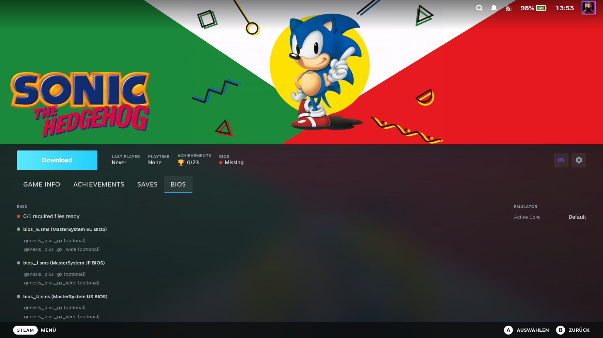

# BIOS and Emulator Core Management

Some emulated systems require BIOS files to run games. Without the correct BIOS files, games for those systems will fail
to launch. The plugin can download BIOS files directly from your RomM server.

Which BIOS files a system needs depends on the **emulator core** in use — some cores need BIOS, some don't. Because the
two concerns are related but independent, the plugin presents the **active core** and its **BIOS state** together in one
place: the **System** page, a top-level QAM destination. Core selection and BIOS file management can each be used on
their own — they share a screen only because the active core determines which BIOS files matter.

## What Are BIOS Files?

BIOS (Basic Input/Output System) files are firmware dumps from original hardware. Emulators need them to accurately
simulate the console's boot process. Common examples:

- **PlayStation** — `scph5501.bin` (and other regional variants)
- **Dreamcast** — `dc_boot.bin`, `dc_flash.bin`
- **Saturn** — `sega_101.bin`, `mpr-17933.bin`

Not all systems need BIOS files. Cartridge-based systems like Game Boy, SNES, and Genesis typically work without them.

## BIOS Status on the Game Detail Page

When you open a game whose platform has BIOS files — on your RomM server, or asked for by the emulator that will run it
— the game detail panel shows a BIOS status indicator. Open the panel's **BIOS** tab to see the readiness line. Its dot
color reflects the same unknown/ok/partial/missing verdict used everywhere in the plugin:

- **Green** — nothing required is missing: "All required ready (2/2)", or "Nothing required (3/5 files held)" when the
  core you launch with requires none of the system's files
- **Orange** — some required files present: "1/2 required files ready"
- **Red** — no required files present yet
- **Grey** — "BIOS requirement unknown": the plugin could not work the requirement out at all (see
  [When the requirement is unknown](#when-the-requirement-is-unknown))

The sentence says what the dot says, and both are about the **required** files. Where the system has none, the dot is
green because nothing required is missing — so the line leads with "Nothing required" and the ratio beside it is
inventory, counting the files your RomM library holds and how many of them you have. It is not a readiness score, and
those files are not "optional" either: a core you are not launching with may well require one.

Both numbers on the line count the same thing. Where the system has required files the ratio is of those; where it has
none, the ratio is of the files your RomM library holds — never one of each. Files your emulator asks for that are not
in your library are listed, but they are not part of that ratio: it tracks what you can still download, and those you
cannot.

The readiness line is computed against the **active core** for that game — so switching to a core that needs no BIOS (or
that treats a file as optional) clears the warning, while switching to a core that requires a missing file surfaces it.

A BIOS warning only ever disappears on an **answer**. When a check cannot be run at all — most often right after a BIOS
download or delete, before the state has been read again — the plugin keeps showing the last status it knew rather than
reporting "no BIOS needed". So a check that could not be completed never quietly clears a missing-BIOS warning and lets
the game launch without its files; it leaves the warning where it was.

"The requirement is unknown" is itself an answer, and a different one. A check that ran and could not establish what the
system needs says so on the page — grey dot, "BIOS requirement unknown" — instead of hiding the BIOS tab. Hiding it
would say the system needs nothing, which is exactly the claim that could not be made. Every PS3 game is in that
position, since RPCS3 is not a RetroArch core and cannot be asked.

It does not leave it there indefinitely, though. Whenever the game detail page is shown a BIOS state it could not work
out — when the page opens, after switching the emulator core, after switching to another version of the game — it asks
again in the background and fills the answer in a moment later. So a game opened while its requirement is still unread
gets its BIOS tab a beat after the rest of the page, and a core or version switch settles on the new core's or new
version's readiness rather than the one before it.

An unreachable RomM server usually does **not** put the plugin in that position. Everything the readiness line needs is
local: which emulator is active comes from your RetroDECK configuration, what that emulator needs comes from the
emulator itself, and what you already have comes from your BIOS folder. Your server contributes the **download** — so
while it is unreachable you still see what is needed and what is missing, you just cannot fetch anything, and files that
exist only in your RomM library are not listed.

Tap the BIOS status indicator to see a detailed list of individual files and which ones are present or missing. Each
file lists the cores that use it (e.g. _Beetle PSX HW (required)_, _SwanStation (optional)_); the **active core**'s line
is highlighted in amber so you can spot at a glance which core's requirements the file applies to.

Files no installed emulator asks for are not listed one by one — they are summarised on a single line below the list ("3
files on server no installed emulator asks for"), as are any files the plugin could not work out an answer for.

A file your emulator needs that is **not in your RomM library** is listed too, marked _missing, not in your RomM
library_. The plugin cannot fetch it — nothing in it can — so it is shown for what it is rather than left out. Adding
the file to RomM makes it downloadable like any other.

<!-- Screenshot: Game detail page showing orange BIOS status with "2/5 required files ready" -->

## System Page

The **System** page is the per-system emulator settings page: for each platform it shows the **active emulator core**
first, then the BIOS files that core needs. It lists only your **currently-synced systems** — platforms with at least
one synced game (whether synced by platform or by collection). Systems you have no synced games for don't appear, even
if your RomM server has BIOS files for them.

1. From the main QAM page, tap **System**
2. Platforms with synced games that still need required BIOS files are marked with "BIOS needed"
3. For platforms with more than one emulator, an **Emulator Core** button is shown at the top of the platform's section
   — this is the primary per-system control; it opens a menu of the platform's emulators
4. Below the core, each platform shows how many of your library's BIOS files are downloaded (e.g. "3 / 5 files"), or how
   many required files are ready when the system has any
5. Tap **Show Files** to see the individual file list for a platform — each row says whether it is _needed_, _optional_,
   _not needed_ or _unknown_ for that platform. A system whose requirement could not be worked out and that has no files
   to list shows **"BIOS requirement unknown"** with no **Show Files** button
6. Tap **Download All** to download all missing BIOS files for a platform
7. Tap **Delete BIOS** to remove that platform's downloaded BIOS files (see below)

<!-- Screenshot: System page showing per-platform Emulator Core button above BIOS download counts -->

BIOS files are downloaded to your RetroDECK bios directory (e.g. `~/retrodeck/bios/`). Some platforms use subdirectories
— for example, Dreamcast BIOS goes into `bios/dc/` and PS2 BIOS goes into `bios/pcsx2/bios/`. The plugin handles the
correct placement automatically.

### Deleting BIOS Files

You can remove a platform's downloaded BIOS files directly from the **System** page. The **Delete BIOS** button appears
only when the platform has at least one downloaded file — its label shows the count (e.g. "Delete BIOS (3)"). Because
deletion is local, the button works even when your RomM server is offline.

1. On the **System** page, find the platform whose BIOS files you want to remove
2. Tap **Delete BIOS**
3. Confirm the action in the dialog that appears

This is a destructive action, so a confirmation dialog asks you to confirm before anything is deleted. Once confirmed,
the plugin removes the BIOS files **it downloaded** for that system from your RetroDECK bios directory and reports the
result. Games that need those files won't launch until you download them again with **Download All** or **Download
Required**.

**It only ever deletes its own downloads.** A file is removed when both of these are true: your RomM library holds it,
and the plugin has a record of downloading it. Everything else in the BIOS folder is left alone, including:

- **Firmware RetroDECK ships itself.** RetroDECK installs some files into the BIOS folder with its own components —
  `bios/dolphin-emu/Sys/codehandler.bin` is one. Your emulator asks for it, so it is listed on the page, but it did not
  come from your library and could not be downloaded again.
- **Files you placed there by hand**, even where the name matches one your RomM library holds. Without a download record
  the plugin has no claim on it.

That is deliberately stricter than "is it in my library": the plugin can only offer to re-fetch what it fetched, so
anything else is not its to remove. If you want one of those files gone, delete it in the file manager. The count on the
button ("Delete BIOS (3)") counts the downloaded files your library holds, so where one of them was placed by hand the
plugin will report deleting fewer than the button said.

The same per-platform delete is also available from the **Data Management** page (under per-platform actions) for
bulk-cleanup workflows.

## Which Systems Need BIOS?

This depends on your emulators, not on your library. Common systems that require BIOS files include PlayStation, PS2,
Saturn, Dreamcast, and some arcade systems. A platform appears with a BIOS status when your RomM library holds firmware
for it **or** one of its emulators asks for a file — so a missing BIOS you have never uploaded is visible rather than
silent.

### Where the plugin gets its answers

The plugin asks your **installed RetroArch cores** what they want. Every core ships a small description file next to it
declaring the firmware it needs and where each file goes, and the plugin reads those live — so the answers follow your
RetroDECK install, including cores that were added after the plugin was released.

**Standalone emulators are not asked.** RetroDECK also offers emulators that are not RetroArch cores — RPCS3, Vita3K,
Cemu, xemu and others — and they state their firmware in their own formats rather than in that one description file.
Reading them accurately is a separate piece of work, so rather than guess, the plugin says it does not know: a system
whose only emulators are standalone reads **unknown** (below), never "not needed".

Each file on your server therefore gets one of four answers:

- **Needed** — an installed core will not run without it
- **Optional** — an installed core can use it but does not require it
- **Not needed** — every RetroArch core this system offers was asked, and none of them wants this file
- **Unknown** — the plugin could not work out an answer (see below)

### When the requirement is unknown

"Not needed" and "unknown" are deliberately kept apart. The first is an answer; the second is the absence of one, and
the plugin will not present it as an all-clear.

A **file** reads unknown when the plugin could not ask every core the system offers — one of them ships without its
description file, or RetroDECK's configuration could not be read at all.

A whole **system** reads unknown, showing a neutral grey status and the text **"BIOS requirement unknown"** instead of a
green all-clear, in either of two situations.

The first is a system with files on the page, not one of which could be answered for. Every row on the platform is
unknown, which is what leaves nothing to base a readiness claim on. A single answered row is enough to keep the normal
green/amber/red status: if the system offers two cores and only one is unreadable, the other core's answers still stand
and only the unanswered rows read unknown. A system whose every file was answered with _not needed_ is not this case at
all — that is a finished answer, and it reads green.

The second is a system with **no files on the page at all**, where the plugin also could not ask anything. An empty list
means "nothing here wants anything" only when every core was asked; when none could be, it means nothing, and reporting
it as ready would be an all-clear over firmware nobody checked. This is the shape a PS3 page has when your RomM library
holds no PS3 firmware: no rows, no cores to ask, and a grey "BIOS requirement unknown". The system keeps its block on
the **System** page for the same reason — dropping it would say there is nothing to manage.

Two causes reach either shape. The common one is a system whose emulators are all standalone — PS3 through RPCS3, for
instance — where there is no core to ask in the first place. The other is a system all of whose cores are unreadable; on
a stock RetroDECK that is rare, since only a handful of bundled cores ship without a description file and just one of
them is offered for any system.

This is informational, not an error: your files may be perfectly fine, the plugin simply can't confirm what is needed.
You can still download them manually through RomM if your emulator needs them. Genuinely BIOS-free systems (such as the
NES) are unaffected — every core answers, none of them wants anything, and the system reads as ready.

!!! note "Systems that used to read \"Not managed by the plugin\" will have moved"

    That state meant only \"no entry in the built-in table\", and the table is gone. Those systems now get whatever the
    installed cores say, which can go three ways: **green**, because no installed core wants any of those files, **red
    or amber**, because one does and the table simply never knew, or **grey**, because the system offers no RetroArch
    core to ask. All three are new, and all three are honest.

## Which Files a Platform Lists

A platform's list has two halves. The first is what your **server** files under that platform — a GBA page lists the
firmware your server holds under GBA, not what it holds under Game Boy. The second is every file an **emulator RetroDECK
offers for that platform** asks for, wherever your server keeps that file and even when your server does not hold it at
all; rows in that half are marked as not being in your RomM library.

The second half follows what you can **launch** the platform with, not how a file is usually catalogued, and the two do
not always line up. RetroDECK offers NooDS under Game Boy Advance, and NooDS does run GBA games. Its description file
names five firmware files — `bios7.bin`, `bios9.bin`, `firmware.bin`, `nds_sd_card.bin` and `gba_bios.bin` — and a core
states its firmware once, for the whole core, with no way to say which of those a GBA game in particular needs. So a GBA
page lists all five: they are exactly the files an emulator you can start a GBA game with declares. Filtering rows out
by the system a file is usually filed under would, wherever such a file is genuinely required, leave you with a game
that refuses to launch and nothing on the page explaining why.

Being listed is not the same as being needed. All five of NooDS's files are optional, so none of them turns a GBA page
red by itself — and what each row means for the core you actually launch with is the next section's question.

## Active Core Detection

Different emulator cores can have different BIOS requirements for the same platform. The plugin detects which core
RetroDECK is actually configured to use and filters the BIOS list accordingly, so you only see the files that matter for
your setup.

### Example: Game Boy Advance

- With **mGBA** (RetroDECK's default), `gba_bios.bin` is shown as _optional_ — mGBA has a built-in high-level BIOS
  replacement
- With **gpSP**, `gba_bios.bin` is shown as _required_ — gpSP cannot run without it

The active core name appears in both the game detail page (the **Emulator** column) and the **System** page. This tells
you at a glance which core the plugin is filtering for.

**How the core is determined:**

1. If you set a **per-game core** for this game in the plugin, that wins. (Per-game cores are stored by the plugin
   itself — see [Per-Game (Game Detail Page)](#per-game-game-detail-page) below.)
2. If no per-game core, the plugin checks for a **per-platform core** you set on the System page — stored by the plugin
   in its own settings, not in ES-DE.
3. The plugin reads RetroDECK's ES-DE configuration (`es_systems.xml`) from the flatpak installation to find the default
   emulator for each platform — for BIOS filtering it uses the platform's first RetroArch core. This live file is the
   only source; there is no bundled fallback snapshot.
4. If a platform offers **only standalone emulators** (no RetroArch core at all), or the live configuration can't be
   read, the plugin has nothing to filter with — so it does not filter, and it does not guess either. Every BIOS file
   the platform has is listed, each marked _unknown_, and the platform's summary reads **BIOS requirement unknown** with
   a grey dot — including when the platform has no files to list, which is where saying nothing at all would have read
   as "nothing needed". That is the honest answer for a platform like PS3, whose emulators the plugin cannot yet ask:
   saying nothing is needed would report it ready over firmware the emulator will not boot without.

Whatever this chain resolves to is the **same core the game launches on** — the plugin bakes the resolved core into the
Steam shortcut, so the core shown for BIOS, saves, and the core badge always matches the core that runs.

The detection chain ensures BIOS filtering works even when RetroDECK's configuration files aren't accessible (e.g. after
an update changes paths). You'll see a "Core: mGBA" badge when detection is working, or no badge when falling back to
showing all files.

## Changing the Active Core

You can change the active emulator core directly from the plugin, without leaving Game Mode. There are two scopes, and
**both are stored by the plugin itself** — neither touches ES-DE's `gamelist.xml`. The plugin bakes the chosen core
directly into each game's Steam shortcut, so your choice applies reliably for any ROM filename.

- **Per-platform** changes set the core for every game on a platform. Stored in the plugin's own settings.
- **Per-game** changes set the core for a single game and take priority over the platform choice. Stored by the plugin
  on the game, so they survive uninstalling and re-downloading.

### Per-Platform (System Page)

On the **System** page, platforms with more than one emulator show an **Emulator Core** button as the first control in
the platform's section, above the BIOS file list. The button opens a menu listing every emulator ES-DE offers for that
platform — both RetroArch cores and **standalone emulators** (e.g. PCSX2, RPCS3, Dolphin, PPSSPP). Some entries appear
**disabled** with a short reason (for example "script/shortcut form" or "needs setup files (launch via ES-DE once)")
when the plugin can't launch them directly from Steam; those can't be picked. Picking an enabled emulator sets it as the
default for all games on that platform. A "Switching cores may affect save compatibility" note appears at the top of the
menu.

1. Open the **System** page from the main QAM page
2. Find the platform you want to change
3. Press the **Emulator Core** button and pick an emulator from the menu
4. The BIOS file list below updates immediately to show files relevant to the new choice

If RetroDECK can't be found (no `es_systems.xml`), the menu shows "Emulator list unavailable — RetroDECK installation
not found" instead of a list.

The plugin stores the choice in its own settings and **immediately re-applies it** to every installed game on that
platform — the change takes effect right away, with no sync needed (games that already have a per-game core keep their
own choice). The System page works even when your RomM server is offline — core switching and BIOS status are available,
only download buttons are disabled.

!!! note "A RetroDECK default-core change needs a Force Full Sync"

    Setting a per-platform core on the System page re-bakes your installed games right away. But if a **RetroDECK
    update** ships a _new default core_ for a platform (and you have not picked a core yourself), that new default does
    **not** take effect on a normal sync — a normal sync skips platforms whose games haven't changed, so the
    previously-baked core stays. Run a **Force Full Sync** to re-bake every game and pick up RetroDECK's new default.

### Per-Game (Game Detail Page)

On the game detail page, a **CPU button** (microchip icon) appears between the RomM and Steam gear buttons when the
game's platform offers more than one emulator. The menu lists the same emulators as the System page — RetroArch cores
and **standalone emulators** — and shows the ones the plugin can't launch from Steam as **disabled** with a short
reason.

1. Open a game's detail page
2. Tap the **CPU button** (microchip icon)
3. Pick an emulator from the menu, or the **Use System Override** item at the top (see below)
4. The BIOS status, core badge, and game info panel update immediately

At the top of the menu, above the core list, is a dedicated **Use System Override (X)** item. Selecting it **clears**
the per-game core so the game follows whatever the system would pick — the per-platform core you set on the System page,
or the platform's default core when no per-platform override is set. **X** is that fallback core's name, shown in
parentheses so you know what the game will fall back to.

Each core in the list below can show up to three markers, one per role:

- **(default)** — the RetroDECK/es_systems default core for this platform.
- **(system)** — the per-platform core you picked on the [System page](#per-platform-system-page) (stored in the
  plugin's settings). Absent when the platform has no per-platform override.
- **✓** (checkmark) — the core this game actually launches with right now.

The three roles are independent, so a single core can carry more than one marker: "(default) (system)" when your
per-platform pick happens to equal the default, or "(system) ✓" when the per-platform core is also the one the game
launches with.

A per-game core takes priority over the platform default. **Every core in the list pins** when you pick it — including
the one marked **(default)**. Pinning the default-marked core fixes the game to that specific core even if you later
change the per-platform override; it is no longer the way to "follow the system".

To drop the per-game core and follow the platform/system core again, pick the **Use System Override** item at the top —
that is the only thing that clears the per-game override. The **✓** can appear in two places at once: when the game is
following the system (no per-game core), the **Use System Override** item carries the ✓ **and** so does the core that is
actually in effect. When you pin a per-game core, only that pinned core carries the ✓ and the **Use System Override**
item does not.

When you set or reset a per-game core for an installed game, the plugin updates the game's Steam shortcut immediately
and confirms the change landed before reporting success. If Steam can't accept the change in the current session, you'll
see a "Core saved — restart Steam to apply" message — your choice is still saved; it takes effect after a Steam restart
(or the next sync).

Per-game cores work for **any ROM filename**. The plugin bakes the chosen core directly into the game's launch command,
so it does not rely on RetroDECK's gamelist lookup (which mishandles parentheses and other special characters in
filenames) and is not affected by that upstream limitation.

### Core choices are not migrated from ES-DE

The plugin now owns core selection entirely and no longer reads or writes ES-DE's `gamelist.xml`. A few notes for anyone
upgrading from an older build or who edits ES-DE directly:

- **Per-platform cores set in ES-DE are not carried over — re-apply them once.** Earlier builds stored a per-system core
  as a `<alternativeEmulator>` in ES-DE's `gamelist.xml`; the plugin now stores per-platform cores in its own settings
  and does **not** read or import that ES-DE entry. If you had set a per-system core, re-apply it once on the **System**
  page (the Emulator Core button/menu) and it sticks from then on.
- **Per-game cores set with an older plugin build are not carried over.** Earlier builds stored per-game cores in
  ES-DE's `gamelist.xml`; the plugin now stores them itself and does not import the old entries. Re-apply any per-game
  core once through the CPU-button menu and it sticks from then on (including across uninstall/re-download).
- **A core set directly in ES-DE is not seen by the plugin.** If you pick a core for a game (or a system) in ES-DE's own
  interface, the plugin's BIOS badge, per-core save path, and core-change warning will **not** reflect it — those follow
  the core the plugin knows about, and the plugin's launches always use the core it has baked in. ES-DE-native launches
  still honour your ES-DE setting. To keep the plugin's badges, save paths, and launches in sync, set the core through
  the plugin (the CPU-button menu for one game, the System page for a whole platform) instead.

### Non-Default Core Indicator

The CPU button changes color to indicate the active core status:

- **Gray** — the default core is active (no overrides)
- **Yellow** — a non-default core is active (per-game or per-platform override)

The game detail info panel shows the active core in a dedicated "Emulator" column alongside the BIOS status, using a
two-column layout.

---

**Previous:** [Managing Games](managing-games.md) | **Next:** [RetroDECK Path Migration](retrodeck-path-migration.md)
