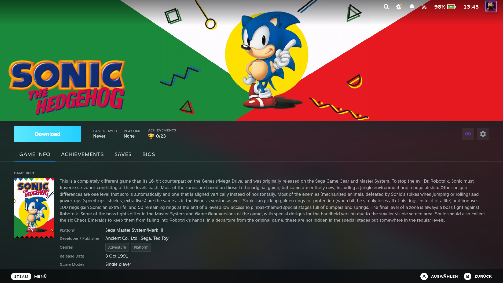
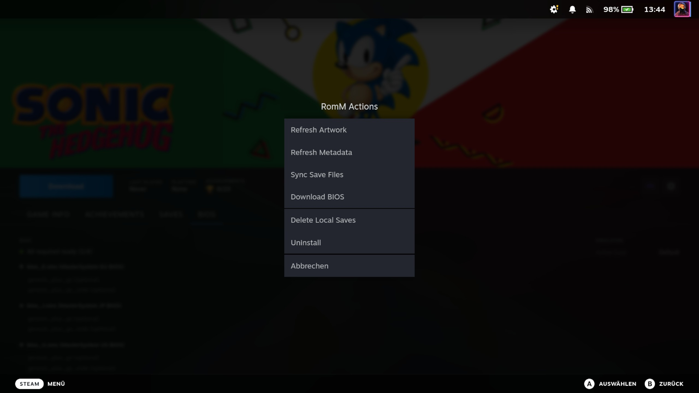

# Managing Games

After syncing, each game in your Steam Library that came from RomM has an injected **RomM Sync** panel on its detail
page. This panel handles downloads, artwork, BIOS status, save sync, and more.

## The Game Detail Panel

When you open a RomM game in the Steam Library, you'll see the RomM Sync panel below the standard Steam content. It
shows:

- **Status badge** — "Installed", "Downloading", or "Not Installed"
- **Platform name** — which system the game belongs to (e.g. "Game Boy Advance")
- **Version switcher** — a compact control next to the Play button (beside the disc picker) to pick which version of the
  game is active, when RomM has more than one (see below)
- **Region / Languages** — attributes of the active version, shown in the Game Info tab when RomM has them (see below)
- **BIOS status** — whether required BIOS files are present (see [BIOS Management](bios-management.md))
- **Save sync status** — last sync time, conflict count, and playtime (see [Save Sync](save-sync.md))
- **Action buttons** — Download, Pause/Resume, Uninstall, Cancel, or Refresh Metadata depending on state

## Versions

Many games exist in a RomM library as several **versions** — different dumps of the same title: a `(USA)` release and a
`(Europe)` one, a multi-language `(En,Fr,De)` dump, a `(Rev 1)` revision, a `(Demo)`. RomM groups these as a **sibling
group** (one game, many versions), and the plugin represents the whole group with a **single Steam shortcut**. The
version currently bound to that shortcut is the **active version** — the one the Download button fetches, and the one
that launches and syncs saves.

### The Switch-version control

When a game has more than one version, a compact **version control** appears next to the Play button — right beside the
disc picker, and only for a multi-version game. Open it to see every version in the group, each with markers for:

- **✓ (active)** — the version currently bound to the shortcut. This is exactly what the Download button will fetch.
- **Default** — the version the plugin would pick on its own, following RomM's "SET DEFAULT" choice (`is_main_sibling`)
  and, failing that, your [Preferred region](configuration.md) setting. It's a suggestion, not a lock.
- **Downloaded** — a version you already have on disk.
- **not synced** — a version RomM has that isn't in your local library yet. Selecting it is fine; the plugin records it
  on the spot.

Selecting a different version **rebinds** the game to it: the Download button now fetches that version, the panel's
title and Region/Languages rows update to reflect it, and its cover refreshes to the new version. The Steam shortcut
keeps its name, its place in your collections, and its playtime — all tied to the shortcut, which never changes. A
single-version game shows no Version control.

Switching **never deletes anything.** ROM files already on disk stay put, and save files are never moved or deleted by a
switch. What happens depends on whether the version you're leaving is downloaded and whether its saves are synced:

- **Not downloaded, or downloaded with all saves already synced** — the switch is instant. If the version you switch
  _to_ is on disk it's playable right away (Play stays Play); if it isn't, the button becomes **Download**.
- **Switching back to a version still on disk** — instant and playable immediately, with no re-download.
- **Leaving a downloaded version whose saves were never uploaded** — a dialog warns you first. It offers **Sync now &
  switch** (uploads the saves, then switches), **Switch anyway** (the saves stay on disk but stop syncing until you
  switch back to that version), and **Cancel**. When RomM is unreachable the saves can't be uploaded, so the dialog
  drops the sync option and offers only **Switch anyway** and **Cancel**, explaining why.

When you leave a downloaded version with unsynced saves behind, the **Saves** tab shows a reminder banner ("switch back
to sync them") so those saves aren't forgotten.

While a download of the game is running, switching is blocked with a short message — cancel the running download first.

While a switch is being applied, the version control briefly shows a spinner and can't be reopened until the switch
settles and its version list refreshes — so a fast second tap can't act against the not-yet-updated list (for example,
switching straight back before the list has caught up).

### Region and Languages

In the panel's **Game Info** tab, the plugin shows the **Region** (e.g. `USA/Europe`) and **Languages** (e.g. `En, Fr`)
of the **active version**, when RomM has them. These are attributes of that one version — they change when you switch
versions, and a version with no region/language detail simply omits the rows. The values refresh on every sync.

## Downloading ROMs

Games appear as shortcuts in your library even before the ROM file is downloaded. To download:

1. Open the game's detail page in the Steam Library
2. In the RomM Sync panel, tap **Download**
3. A progress bar shows download status with bytes transferred
4. When complete, the status changes to "Installed" and the game is ready to play

<!-- Screenshot: Game detail page during a download with progress bar -->

You can also abort a download in progress — tap the **X** that appears on the right of the download button on the game's
detail page, or use **Cancel** in the QAM download queue. Only the partial transfer files are cleaned up — an
already-installed copy of the game is never removed, so cancelling a re-download (or a download that fails partway)
leaves your existing install intact. If the cancel happens to land just as the download finishes, the game is kept as
**Installed** rather than torn down.

Downloaded ROMs are stored in your RetroDECK roms directory (e.g. `~/retrodeck/roms/gba/`).

**Only one version of a game is downloaded at a time.** If you tap **Download** on a version while another version of
the same game (its [sibling group](#versions)) is already on disk, the plugin removes the old install first and then
downloads the new one — no prompt. This keeps a multi-version game to a single copy on disk. Your **save files are never
touched** by this cleanup, so switching back and re-downloading the earlier version rejoins its saves. Games that still
carry a separate shortcut per version from an older release are left untouched.

### Pausing and Resuming a Download

A running download can be **paused** and later **resumed** without losing the progress already transferred. On the game
detail page, a resumable download shows a chevron next to the progress button — open it and choose **Pause**; the button
freezes at its current progress and shows **Paused**, and the same menu then offers **Resume**. You can do the same from
the QAM download queue, where a downloading item gets a **Pause** button and a paused item gets a **Resume** button (a
paused download stays in the active list, not the finished one).

Resume is only available for **single-file ROMs on a direct connection** — the server has to support resuming a transfer
from where it left off. Two cases can't resume, so they show only **Cancel** (no Pause/Resume):

- **Multi-file ROMs** (multi-disc or bin/cue titles downloaded as a single ZIP), and
- **Servers behind Cloudflare** (the Cloudflare Tunnel doesn't honour partial-content requests).

In those cases, cancelling and starting over is the only option — but a fresh download is safe, as cancelling never
removes an already-installed copy.

### Multi-Disc and Multi-File Games

Some games ship as more than one file — multi-disc PS1 titles, a base game plus updates and DLC, a BIN+CUE pair. RomM
downloads these as a single ZIP, which the plugin extracts automatically. You just download and play; the layout is
handled for you.

After the byte transfer finishes, the download button and the QAM queue show a brief **Extracting…** phase with its own
progress (the percentage climbs back from 0 as the archive unpacks — a large Switch or disc image takes a moment). The
extraction can't be cancelled, so the cancel/pause controls are replaced by a spinner until it's done; the game then
flips to **Installed** as usual. Single-file ROMs download as a bare file and skip this phase entirely.

The plugin gives the extracted game its own folder and names that folder after the real **launch file** (including the
extension, e.g. `Final Fantasy VII (USA).m3u/` or `Halo 3 (USA).iso/`) so that ES-DE collapses it into a single game
entry instead of showing a folder plus loose files.

**Disc switching only applies to systems whose emulator supports it.** For the disc-swapping consoles — PS1, Saturn,
Sega CD, PC Engine CD, Dreamcast, GameCube, Wii, and the like — a game-named `.m3u` playlist is generated so you can
flip between discs in-game, and the folder is named after that playlist. The plugin decides this by reading ES-DE's own
per-system supported-extension list, so a game only ever gets an `.m3u` on a system where ES-DE (and the emulator behind
it) actually understands one.

**Cartridge and folder systems get no playlist.** Switch (`.nsp`), Xbox 360 (`.iso`), and other systems with no disc
concept collapse to their real game file instead — the folder is named after the cartridge/disc image (`<Game>.nsp/`,
`<Game>.iso/`) and the game launches straight from it. RomM bundles a generic `.m3u` into every multi-file ZIP, but the
plugin ignores it on these systems rather than launching from a file the emulator can't read.

Single-file titles (most `.chd`/`.iso` games on disc-image systems) download as a bare file with no folder, so they need
no playlist either way.

!!! note "Known limitation"

    Games installed **before** this version keep their old folder layout, so ES-DE may still show them as a folder plus
    loose files — or, on cartridge systems, as a stray `.m3u`. The fix only affects new downloads; re-download the game
    to get the single clean ES-DE entry.

## Picking a Disc for Multi-Disc Games

When an installed game has more than one disc, a small **disc dropdown** appears on the game detail page, right next to
the **Play** button. Its face shows the disc that will launch (a 💿 with the disc's label), so it doubles as a badge —
single-disc games show no dropdown at all.

To pick a disc:

1. Open the game's detail page in the Steam Library.
2. Tap the **💿 disc dropdown** next to Play.
3. Choose the disc (or "All discs" — see below). The Play button now launches that disc.

That's the whole flow — there's no separate save step. The next time Steam launches the game, it launches the disc you
picked.

### What "All discs" means

On the **disc-swapping consoles** (PS1, Saturn, Sega CD, PC Engine CD, Dreamcast, GameCube, Wii, and the like) a
multi-disc game gets a generated `.m3u` playlist, so the dropdown's default entry is **All discs (m3u)** — it launches
through the playlist and lets you flip between discs **inside the emulator**, no relaunch needed. You can still pick a
single disc from the same dropdown to jump straight to it.

On systems with **no playlist concept**, there's no in-emulator disc switching, so the dropdown defaults to **Disc 1**
and switching discs means picking a different disc here and relaunching. Either way, the picker works the same.

The dropdown only ever lists discs your emulator can actually launch — it reads ES-DE's own per-system file-type list,
so you'll never be offered a disc image the emulator can't open.

### Your pick sticks

The selected disc is **saved**, and it survives the things that would otherwise reset it:

- **A library re-sync** never changes your pick.
- **Uninstalling and re-downloading** the game restores it — the choice is remembered against the game, not the
  downloaded files, so a reinstall re-applies it automatically.
- A **RetroDECK path migration** (moving your RetroDECK home) keeps it too.

If the specific disc you pinned ever goes missing (for example a partial re-download), the game quietly falls back to
the default disc rather than failing to launch.

### Where it applies

The disc you pick applies to **the Steam shortcut this plugin created for the game**, whenever Steam launches it — in
**game mode** (the couch UI) or **desktop mode**. It does **not** touch any custom non-plugin shortcut you set up
yourself (for example a hand-made Xenia or standalone-emulator shortcut) — those carry their own launch command, which
the plugin doesn't manage.

!!! note "RetroDECK is the supported launcher"

    The disc picker launches through RetroDECK, the supported launcher today. PS1 and the other `.m3u` disc-swapping
    systems are fully covered; systems that need an external standalone emulator to run at all are a separate roadmap
    item.

## Uninstalling ROMs

To remove a downloaded ROM file:

1. Open the game's detail page
2. Tap **Uninstall** in the RomM Sync panel
3. The ROM file is deleted from disk
4. The shortcut remains in your library so you can re-download later

This only removes the ROM file — the Steam shortcut, artwork, and metadata are preserved.

## Refreshing Artwork and Metadata

Tap **Refresh Metadata** in the game detail panel to:

- Re-fetch hero banner, logo, wide grid, and icon from SteamGridDB
- Re-fetch game metadata (description, developer, genres, release date) from RomM
- Update the native Steam display with the latest information

This is useful if artwork was missing on first sync (SteamGridDB may have added new images since) or if metadata has
changed on your RomM server.

When you tap **Refresh Artwork**, the plugin asks your RomM server which SteamGridDB game the ROM maps to and applies
the hero banner, logo, wide grid, and icon for that game. **RomM is the source of truth**: whenever your server has a
SteamGridDB id for a game, that id wins — on both sync and refresh. If RomM has no id, the plugin tries to derive one
from the game's IGDB id. Only when neither resolves a SteamGridDB game does a picker open, where you search SteamGridDB
by name and choose from the results (with thumbnails). A name pick is applied immediately but is **not permanent** —
once your RomM server has a SteamGridDB id for that game, that id takes over. Because a manual pick isn't stored as the
resolved id, you can change it any time: just tap **Refresh Artwork** again and the picker reopens. To pin a specific
match for good, set the SteamGridDB id on the game in RomM.

The full set of per-game actions — refresh artwork, refresh metadata, sync save files, download BIOS, and uninstall — is
available from the RomM Actions menu in the game detail panel.

## Download Queue

The **Downloads** page (accessible from the main QAM panel) shows all active and completed downloads:

- Active downloads with progress bars, plus pause/resume and cancel buttons (pause/resume only where the download is
  resumable — see [Pausing and Resuming a Download](#pausing-and-resuming-a-download))
- Completed, failed, and cancelled downloads with status details
- **Clear Completed** button to clean up the list

At most **two** ROMs download at the same time. If you start more, the extra ones wait their turn and begin
automatically as soon as a slot frees up. Before a download starts, the plugin checks there's enough free disk space for
everything already in flight, so a batch of downloads won't overcommit the SD card.

<!-- Screenshot: Download Queue page with an active download and completed entries -->

## Launching Games

Select any installed game in the Steam Library and press **Play**. The full launch command is baked into the Steam
shortcut when the game is synced or downloaded, so launching just runs that command:

1. The shortcut launches RetroDECK with the correct ROM path
2. RetroDECK auto-detects the system from the ROM's directory path and uses the appropriate emulator
3. If you picked a [per-game core](bios-management.md#per-game-game-detail-page), the chosen core is baked into the
   command and used directly
4. For a multi-disc game, the [disc you picked](#picking-a-disc-for-multi-disc-games) is the one that launches

If the ROM is not downloaded, pressing Play won't launch a game — download it first from the game's detail panel; the
shortcut's command is filled in automatically when the download completes.

---

**Previous:** [Syncing Your Library](syncing-your-library.md) | **Next:** [BIOS Management](bios-management.md)
