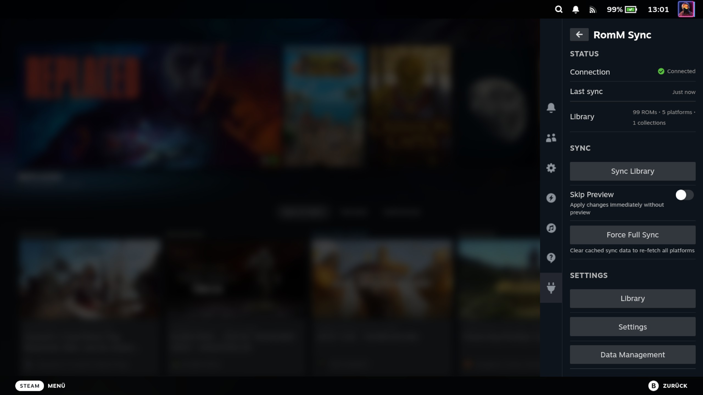

# Syncing Your Library

Syncing fetches your RomM game library and creates Non-Steam shortcuts in Steam for every game. After syncing, your
games appear in the Steam Library with cover art, metadata, and organized into collections.

## How Sync Works

1. The plugin fetches all ROMs from your RomM server (filtered by your enabled platforms)
2. For each ROM, a Non-Steam shortcut is created in Steam via the SteamClient API — no restart required
3. Cover art from RomM is applied as the portrait grid image
4. If you have a SteamGridDB API key configured, hero banners, logos, and wide grid images are also fetched
5. Metadata (description, developer, genres, release date) is cached and displayed in the plugin's custom game detail
   panel
6. Steam collections are created per platform (e.g. "RomM: Game Boy Advance (steamdeck)")

## Starting a Sync

1. Open the QAM and navigate to the plugin
2. Tap **Sync Library** on the main page
3. The plugin works out what would change and shows you a preview; tap **Apply Sync** to start the run, or **Cancel** to
   throw the preview away (with **Skip Preview** switched on, the run starts straight away instead)
4. A progress bar shows the sync status
5. When complete, a toast reports what actually changed — the true delta, not the total in your library. It shows the
   number of shortcuts added and/or removed this run (e.g. "Sync complete — 42 added, 3 removed."), omitting a part that
   is zero. If nothing changed, it reads "Library up to date."

<!-- Screenshot: Sync in progress with progress bar -->

You can tap **Cancel Sync** to stop mid-sync. Games already added will remain. A cancelled sync never removes any Steam
collections — stale-collection cleanup only runs after a sync finishes in full, so cancelling can never wipe the
collections for platforms the run did not reach. If the cancel request itself does not get through, the run is still
going, so the panel keeps showing its progress with **Cancel Sync** ready to try again rather than offering to start a
second run on top of the first.

## Time estimate and progress

Before you start, the sync preview shows a **Changes** block: what the run will add, update, or remove, and below it one
line with the run's coverage and estimated time (for example "Syncing 3 platforms · 2 collections — 3 min"). The sync
only touches the games that are actually new or changed — games that are already correct in your library are skipped
entirely, not re-processed — so a re-sync of a mostly-settled library is quick, and the estimate reflects only that
changed work. If you sync without previewing first, the estimate appears once the run starts as an **Estimated time**
line, shown as "up to X min".

Cover changes count too: if you replaced a game's cover on the server but nothing else changed, the preview reads "No
shortcut changes — N cover updates" and still offers **Apply Sync** — applying refreshes those tiles without touching
the shortcuts. Only when there is truly nothing to do does the preview read "Everything is up to date."

A preview stays good for **30 minutes**, and it belongs to the plugin rather than to the page you are looking at: you
can leave the main page for the settings or a submenu, come back, and the same preview is still there with **Apply
Sync** ready. That holds while it is still being worked out, too — leave while the plugin is comparing your library and
come back, and you get the progress bar for the comparison that is still running, then its card the moment it finishes,
whether you were watching or not. The card tells you how long that has left — "Expires in 26 min" just above the button,
counting down. If you leave it sitting past the half hour, the card stays where it is and says "Expired — run the
preview again"; the change list remains readable, **Apply Sync** goes away, and the card only disappears when you tap
**Dismiss**. Nothing you were shown is discarded behind your back. Tapping **Sync Library** again works out a fresh
preview against whatever your server holds now.

That starting estimate is **skip-aware**: when the run is planned, the plugin already knows which platforms haven't
changed since their last sync and expects to skip them wholesale, so they don't inflate the number — an incremental
re-sync of an unchanged library reads seconds, not the minutes a full first import would take. The prediction is only an
estimate (the actual skip is decided per platform, and per collection, as the run reaches it), so a wrong guess can make
the readout run long or short for a moment, but it never changes what the sync actually does. Collections are skipped
the same way a platform is: if a collection's membership hasn't changed and none of its games did either, the plugin
skips it without re-listing its contents — so a large, collection-heavy library re-syncs quickly.

The estimate also knows the **difference between adding a game and updating one**. Creating a shortcut is roughly three
times the work of refreshing one that already exists, and it also has to pull down a cover; updating an existing
shortcut does neither. So a re-sync over games your library already has is estimated at the cheaper update rate rather
than as though it were building your library from scratch — including a **Force Full Sync**, which re-applies every game
your platforms already hold but adds none, so its platforms are estimated at that cheaper rate too. One exception
remains: after a Force Full Sync, your **collections** are estimated at the dearer "adding" rate for that run. The
plugin only knows which games are in a collection from the record it keeps when that collection last finished syncing,
and Force Full Sync deliberately wipes those records — so for that one run it can't tell that your collections' games
are already in Steam. The run itself is unaffected, and the estimate only ever reads too long, never too short. Cover
updates are counted on their own, so a run that only refreshes cover art is estimated from how many covers changed
instead of falling back to a fixed number.

Once the sync has been creating shortcuts for a few seconds, that "up to" ceiling is replaced by a **live countdown** —
"2 min left" — measured from the actual speed on your device and updated as the run proceeds. The countdown waits until
it has genuinely measured the apply speed before it appears: at the very start of a run the plugin takes a one-off look
at the shortcuts already in Steam, which can take ten seconds or so on a large library, and readings taken across that
pause would make the first countdown read several times too long. Both the countdown and the progress counter show
**net** progress: they count the games this run actually needs to add or update (say "100/801"), not every game in your
library. It holds steady across the short pauses where the sync fetches the next platform's game list, rather than
jumping around. The main progress bar apportions its width the same way — a platform expected to skip takes no space,
and a huge platform fills the bar in proportion to its real work instead of an equal slice per platform. The one
exception is a run that _opens_ with platforms that have nothing to add: those still refresh cover art, so they would
leave the bar sitting at empty for as long as they work. Each of them therefore claims an ordinary equal slice, and the
platforms that do have games to add fill the rest of the bar between them.

A few things worth knowing for a large library:

- **The progress bar advances through each phase.** For a large platform the sync first pulls the game list from your
  server page by page, then downloads cover art, then starts creating shortcuts; the line names what it is doing (e.g.
  "Fetching Game Boy Advance (page 12/62)" then "Preparing covers for Game Boy Advance"), and the bar now edges forward
  through the fetch and cover phases as well — not only while shortcuts are being created. A platform whose cost is
  mostly its cover pull no longer shows a bar that sits frozen until the very end, and the bar never jumps backwards as
  the phases hand over. When a platform's games are already up to date and only their cover art changed on the server,
  the line counts those cover updates as they apply — "Game Boy: covers 37/140" — instead of resting at a bare "0/0".
- **Cover art fills in as the run goes.** Covers appear on your library tiles progressively while the sync creates
  shortcuts, not only at the very end, so you can watch the library fill in. A few tiles may stay gray until the first
  time you open that game's page (or the next time Steam restarts) — that is expected and does not mean the cover is
  missing.
- **Progress is saved as it goes** — roughly every 200 games. If Steam crashes or you cancel partway through, the games
  already created are kept, and the next sync picks up where it left off instead of starting over.
- **Cancelling keeps finished games.** Everything added before you cancel stays in your library; cancelling never
  removes finished games (and never removes Steam collections).
- **Sleep is safe; keep it powered.** If the Deck sleeps mid-sync the run pauses and resumes on wake — it does not stall
  or lose progress. For a large first sync, plug it in so the battery lasts the whole run.
- **A very large sync may pause itself to protect Steam.** Steam holds every shortcut it creates in memory for the rest
  of the session, and that memory only frees on a Steam restart. A very large first import can approach that limit, so
  the plugin watches Steam's memory and, when it gets close, pauses cleanly at a safe point rather than risking a Steam
  crash. If the preview expects this, it shows a blue note up front ("will likely pause partway to protect Steam's
  memory — normal for large syncs"). When a pause happens, the sync page shows a **blue banner** — "Steam memory is full
  (2.3 GB). 1200 of 2001 games done. Restart Steam, then Resume Sync." — that stays until you resume, and a toast says
  the same. The banner reports how far the run got, so you can see how much is left before you resume. Restarting Steam
  frees the memory and the resume finishes the job. Once you've restarted, the banner notices on its own — it changes to
  "Steam memory is free again (0.4 GB). 1200 of 2001 games done. Press Resume Sync to continue." and drops the restart
  button, so you know a resume will actually work now rather than pausing again. Nothing is lost, and you are never
  forced out of what you were doing. After a big run finishes with memory still high, a **yellow banner** recommends a
  Steam restart before your next large sync; it clears itself once you restart.
  - **The banner names whichever button is actually there.** If you press **Force Full Sync** while a paused run is
    showing, there is no longer anything to resume — so the banner stops saying "Resume Sync" and names **Sync Library**
    instead ("Restart Steam, then Sync Library.", or "Press Sync Library to start over." once memory is free). It also
    drops the "1200 of 2001 games done" sentence there, because that head start is exactly what the force-clear
    discarded: the next run does all of it again.
- **Tap "Restart Steam now" to free the memory.** Both banners include a **Restart Steam now** button. It restarts the
  Steam client (Steam closes and reopens) — the reliable way to reset its memory — and you can Resume Sync once it comes
  back. The button is disabled while a game is running (a restart would close your game), so close your game first; it
  is also unavailable while a sync is actively running.
- **The top of the panel shows Steam's current memory.** A **Steam memory** row sits alongside Connection and Last sync,
  so you can see how close Steam is to its limit at a glance (it's hidden only if the reading can't be taken); while a
  sync is running it refreshes every few seconds so you can watch the number climb. The number is colour-coded — green
  when there's plenty of headroom, yellow as it gets high, red once it's near the limit where syncs pause. On the same
  line it shows how much the last run (whether it finished, paused, or was cancelled) grew Steam's memory — for example
  "0.6 GB · last run +1.5" — so a big import tells you why the number climbed.

## Resuming an interrupted sync

Because progress is saved as the sync goes, a run that does not finish is never wasted — you just run sync again to
complete the job.

- **The main page tells you when the last run didn't finish.** The **Last sync** line normally shows when the last full
  sync completed. If your most recent run ended early, a second line reports that attempt and how it ended — "last
  attempt: 17:48 (interrupted)" if a crash or a Steam reload stopped it, "(paused)" if the memory guard paused it, or
  "(cancelled)" if you tapped Cancel Sync — so a partial run that still added hundreds of games never reads a misleading
  "Never". The end-of-run toast and the sync status line make the same distinction: a run stopped by a crash or Steam
  reload reads "Sync interrupted — … so far." rather than blaming a Cancel you never pressed, and the status line
  compares progress against the run's planned total (e.g. "3 of 10 games processed").
- **The Sync button becomes "Resume Sync".** When a run was cancelled, interrupted, or paused and left work the next run
  can skip, the **Sync Library** button changes to **Resume Sync**. Pressing it completes the library: the platforms
  that already synced in full are skipped, and even in the platform that stopped, only the games it hadn't finished are
  processed — the ones already correct are skipped, so a resume finishes quickly and the counter shows just the
  remaining work. This is true whether or not you restart Steam in between. Once a run finishes in full, the button goes
  back to **Sync Library**.
  - **A run that stopped early still counts.** Even a run cancelled inside its very first platform had already added
    games and would skip them next time, so that is a resume too. The button stays **Sync Library** whenever there is
    nothing for the next run to skip — for instance a first run stopped before a single game was added, a **Force Full
    Sync** since (see below), or removing your shortcuts in the meantime. A run that ended in an **error** also keeps
    the plain label: those usually fail before adding anything, so "resume" would be the wrong word for it.
  - **The line under the button says how much a resume would skip** — for example "1200 games already synced — a resume
    continues from there." It counts what is already done, not what is left: the plugin can only know the finished side
    without asking your server, so no total is shown. It is left out in the one case where the plugin knows a resume is
    possible but cannot put a number on it — a library synced before the plugin started recording per-game progress,
    where whole platforms are skipped but no individual game is counted.
- **Force Full Sync starts over from scratch.** Under the sync buttons, **Force Full Sync** clears the plugin's record
  of what it has already synced and re-fetches every platform and collection from RomM on the next run — and that run
  also rewrites every shortcut instead of skipping the ones that look correct, so it repairs anything that drifted on
  the Steam side (a manually edited or broken shortcut). Reach for it if you suspect a platform is out of sync or want a
  clean rebuild; a normal Sync (or Resume Sync) is enough for everyday updates. It appears once you have run at least
  one sync.
  - **Your "Last sync" line is left alone.** Force Full Sync only re-arms the next run — it does **not** wipe your sync
    history, so the **Last sync** line keeps showing when your library last synced (or the last attempt) instead of
    dropping back to "Never". The next preview names the full re-sync explicitly: above the change line it reads **"Full
    re-sync — all platforms re-fetched."**, so a big "Games: … updated" count reads as the intended rebuild rather than
    a surprise. The button stays put after you press it — pressing it again simply re-arms the same fresh start.
  - **"Resume Sync" goes back to "Sync Library".** Force Full Sync discards exactly the records a resume would continue
    from — both what it knows about finished platforms and what it knows about each already-correct game — so nothing is
    left to resume: the button reads **Sync Library** again even when your last run was cancelled or interrupted, and
    the line naming what would be skipped goes with it. Your games stay in Steam; it is only the plugin's record of what
    is already correct that goes, which is what makes the next run redo all of it. Whichever button you press next, the
    run is a full one — the label now says so rather than promising otherwise.

## Multiple versions of a game

When your RomM library holds several dumps of the same game — region variants like `(USA)` / `(Europe)` / `(Japan)`,
multi-language dumps, or revisions — the plugin treats them as **one game** and creates **one Steam shortcut** for it,
not one per dump. RomM already groups these versions together; the plugin mirrors that grouping. Because of this, the
sync counts (in the preview and the completion toast) count **games**, not individual files: a five-region game is one
"added", not five.

The version the shortcut points at (the **active version**) is chosen automatically: a version you have already
installed wins, otherwise the shortcut follows the "SET DEFAULT" version you picked in RomM, otherwise the plugin picks
the best dump for you (see below). Switching versions from inside the plugin is a later feature; for now the active
version follows what is installed and RomM's default.

**How the plugin picks the best dump, and how the shortcut is named.** When nothing is installed and you haven't set a
default in RomM, the plugin ranks the dumps like a 1G1R (one-game-one-ROM) tool. A **finished release always beats a
prerelease** — a beta, prototype, alpha, sample or demo dump loses even to a finished release from a less-preferred
region (so a finished Japanese dump wins over a US beta). Among finished dumps, it prefers a region in the fixed order
**World → USA → Europe → Japan**, then any other region alphabetically, and a dump with no region last. (This is a fixed
order, not language or system detection.) Within one region it then prefers the **newest revision** (a `(Rev 1)` dump
over the plain release, a `(Rev 3)` over a `(Rev 1)`), and finally prefers the plain base game over a filename-only
re-dump like `(Virtual Console)` or `(Extended Edition)`. You can change the preferred region — see
[Preferred region](configuration.md#preferred-region) in Configuration. The **name** of the Steam shortcut follows the
same ranking (ignoring what's installed or set as default), so a multi-region game gets a readable name rather than
whichever dump happens to sort first: a game with two Japanese dumps and one US dump is named after the US dump, while a
game that only exists as a Japanese dump honestly gets its Japanese name. The name is chosen **once, when the shortcut
is created, and never changes automatically** afterwards — even if you later switch to a different version, change the
RomM default, or change the preferred region. This keeps the shortcut's artwork, collections and playtime intact. It
does mean the shortcut's name can differ from the version it currently launches, and that changing the preferred region
only affects games synced **after** the change.

If you synced **before** this update and already have several Steam shortcuts for one game, those existing shortcuts are
**kept** — the plugin never deletes a shortcut you can see. They converge to a single entry naturally as you uninstall
the extra versions.

## Per-Platform Toggles

Not every platform in your RomM library needs to be synced to Steam. Use the **Platforms** page to enable or disable
individual platforms.

1. From the main page, tap **Platforms**
2. Each platform shows its name and ROM count
3. Toggle platforms on or off
4. Use **Enable All** / **Disable All** for bulk changes
5. Only enabled platforms are included in the next sync

For a platform you have already synced, the count shows the number of **games** it syncs into Steam — multiple versions
of the same game (regional dumps, revisions) collapse into one shortcut, so this can be lower than the raw file count on
your server. A platform you have never synced shows the server's raw ROM count until its first sync.

All platforms are enabled by default until you change a toggle. Turning one platform off affects only that platform —
every other platform stays enabled and keeps syncing.

<!-- Screenshot: Platforms page with toggle switches and ROM counts -->

## Collections

The plugin automatically creates Steam collections for each synced platform. Collection names include your machine's
hostname to avoid conflicts if you run the plugin on multiple devices:

- `RomM: Nintendo 64 (steamdeck)`
- `RomM: Game Boy Advance (steamdeck)`
- `RomM: PlayStation (htpc)`

Collections appear in Steam's library sidebar and can be used to browse games by platform.

### Syncing RomM collections

The **Collections** page groups collections into three kinds, selected by a **Standard / Smart / Virtual** button row,
plus a dedicated top-level toggle for RomM favorites.

- **Sync RomM favorites** (top-level toggle) — the standard collection RomM auto-manages as your favorites. Always
  exactly one per account, so it sits above the kind buttons as a single switch. It stays visible but grayed out when
  your account has no favorites collection.
- **Standard** — your other manually-created collections
- **Smart** — filter-based collections that resolve membership at query time, so syncing always picks up the current
  matches
- **Virtual** — auto-generated groupings RomM derives from IGDB metadata: both IGDB **franchise** groupings and IGDB
  **collection** (series) groupings. Each row is labelled with its type (Franchise / IGDB Collection).

The selected kind shows its match count in the section header (e.g. `STANDARD COLLECTIONS (4)`, under the current **Mine
/ All** scope — the count appears once the list has loaded, so it never flashes an empty `(0)`) and lets you toggle
individual collections. A **search box** filters the selected kind by a **fuzzy** name match (its heading is labelled
_Search collections (fuzzy)_), so a loose or partial query still finds a name — most useful on **Virtual**, which can
run to hundreds of entries. On **Virtual** a segmented **All / Franchise / IGDB Collection** control narrows the list to
one virtual type. The list itself is capped for performance: when more collections match than fit, the first rows render
and a `… more — refine your search` hint appears — type in the search box to bring the rest into view.

The scope toggle and the kind buttons appear as soon as you open the page — the collection list loads in behind them, so
you can switch kinds or start typing a search straight away. **Enable All** / **Disable All** stay disabled until the
list has finished loading.

The paired **Enable All** / **Disable All** buttons act on the **current filter**: with a search or the Virtual per-type
filter active, they toggle exactly the matching collections; with no filter they toggle the whole kind and ask for
confirmation first, since that can be a large number.

The **Show collection games in platform groups** setting — whether games pulled in via a collection also get added to
their platform's Steam group — now lives on the **Settings** page under **Library**, alongside the preferred-region
preference. It applies to every sync, so it sits with the other set-and-forget preferences rather than on this tab.

#### Mine / All

On a **shared RomM server** the collection list includes every other user's _public_ collections alongside your own. The
**Show collections** control at the top of the Collections page lets you narrow that down:

- **All** (default) — every collection the server lists, including other users' public ones. This is the original
  behaviour.
- **Mine** — only the collections you own. Foreign collections are hidden from the tabs and are excluded from the sync,
  even if one was enabled earlier — switching back to **All** brings your earlier choices back, since the scope filters
  over your enable state rather than changing it.

**Virtual collections always appear** under either setting: they are auto-generated groupings that have no owner, so
"Mine" never hides them. The filter only becomes active once the plugin knows your account identity, which it learns the
first time you sign in (existing sign-ins pick it up on the next connection check). Until then, **Mine** behaves exactly
like **All** — it never hides a collection it can't yet attribute.

#### Collections that share a name

If two enabled collections share the same name — for example a personal collection and a smart or virtual collection
called the same thing, or (on a shared server) another account's public collection — what happens depends on the
**Distinguish collection types in Steam names** setting on the **Settings** page under **Library**:

- **Off** (default) — the same-named collections **merge into a single Steam collection** carrying the combined set of
  games. RomM allows collections to share a name, but Steam identifies a collection by its name, so the plugin unions
  their members rather than dropping one. Names that differ only in **capitalisation** ("7 up" vs "7 Up") count as the
  same name and merge too — Steam itself treats collection names case-insensitively.
- **On** — the plugin appends the collection **type** to the Steam name, so same-named collections of different types
  stay **separate**. A franchise and an IGDB collection that share a name become `RomM: [<name> (Franchise)]` and
  `RomM: [<name> (IGDB Collection)]` — matching the Franchise / IGDB Collection / Smart / Standard labels you see on the
  Collections page. Collections that share both a name **and** a type still merge.

The setting applies on the **next normal sync** — no Force Full Sync is needed. After flipping it, run a sync and the
plugin renames the affected Steam collections (and removes the old-named ones) as part of its normal end-of-sync
housekeeping.

## Artwork

Each synced game gets up to five types of artwork:

| Type                  | Source      | Where It Appears                |
| --------------------- | ----------- | ------------------------------- |
| Portrait Grid (cover) | RomM        | Library grid tiles, collections |
| Hero Banner           | SteamGridDB | Game detail page background     |
| Logo                  | SteamGridDB | Title overlay on hero banner    |
| Wide Grid             | SteamGridDB | Recent games shelf, list view   |
| Icon                  | SteamGridDB | Taskbar, small UI elements      |

Cover art is always applied from RomM. The other four types require a
[SteamGridDB API key](configuration.md#steamgriddb-api-key). Games without a SteamGridDB match will show Steam's default
placeholders for those slots.

You can refresh artwork for any individual game from its
[game detail page](managing-games.md#refreshing-artwork-and-metadata).

## Re-Syncing

Running sync again updates your library with any changes from RomM (new ROMs, removed platforms, etc.). Existing
shortcuts are updated rather than duplicated. If the specific version a shortcut pointed at is removed from RomM but the
game still has other versions on the server, the shortcut is **kept** and quietly re-pointed at a surviving version — it
is not torn down and re-created, so its artwork, collections, and playtime are preserved.

Sync itself never purges a retained local ROM row, installed content, saves, or playtime solely because RomM stopped
returning that id. Removing that state requires the separate confirmed
[Clean Up Removed RomM Games](managing-games.md#cleaning-up-versions-removed-from-romm) workflow.

## Removing Shortcuts

To remove synced games, use the **Danger Zone** page. See
[Troubleshooting — Danger Zone](troubleshooting.md#danger-zone) for details on the available removal options.

If you delete a synced game directly from **Steam's own library** (rather than the Danger Zone), the next sync brings it
back. The plugin notices the shortcut is gone at sync start and re-creates it, so deleting through Steam is not a
permanent way to remove a RomM game — use the Danger Zone for that.

---

**Previous:** [Configuration](configuration.md) | **Next:** [Managing Games](managing-games.md)
