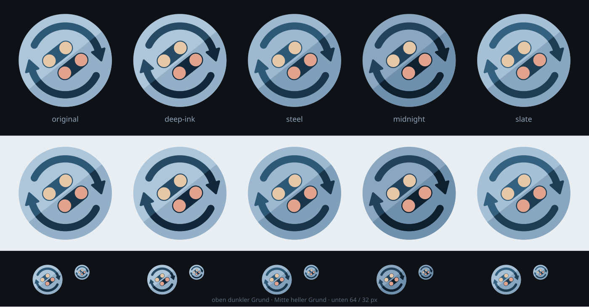

# Logo

The plugin mark: a button diamond ringed by a pair of sync arrows, set in a disc and split along a facet that runs
parallel to the buttons' own slant. It animates — the ring turns while the diamond folds into a d-pad cross and back.



## Regenerating

```sh
python3 build.py --install
```

That renders everything and writes each shipped copy from the same render, so `assets/` and `docs/assets/` cannot drift
apart. Needs `rsvg-convert` and `ffmpeg` on PATH. Without `--install` it writes to `out/` instead, which is the way to
look at a change before it lands.

| File                        | Where it goes                                       |
| --------------------------- | --------------------------------------------------- |
| `logo.svg`                  | `assets/`, `docs/assets/` — MkDocs' nav-bar mark    |
| `logo.png` (512px)          | `assets/`, `docs/assets/` — the docs site's favicon |
| `logo-animated.gif` (512px) | `assets/`, `docs/assets/` — README and docs landing |
| `store_image.png` (1024px)  | `assets/` — the Decky store pulls this one by URL   |

`gen.py` and `anim.py` also stand alone, for looking at one thing:

```sh
python3 gen.py                     # contact sheet of every palette
python3 gen.py --asset steel       # one mark, transparent outside the disc
python3 gen.py --asset --morph 1   # the D-pad end of the fold
python3 gen.py --asset --no-dots   # bare body, for judging silhouette
python3 anim.py --plot             # the morph and spin schedule, frame by frame
python3 anim.py --frame 18         # one frame's SVG
```

## Changing things

Three config objects, and nothing else worth editing:

- **`gen.Palette`** — one row per candidate in `PALETTES`; `CHOSEN` names the one that ships. Each carries two facet
  pairs, disc and ink, given as (above-left, below-right). The two warm dot colours are shared across every candidate.
- **`gen.Geometry`** — every position and size, in a 200-unit square. Grouped by what they describe: the disc, the sync
  arrows, the button diamond, the dot shapes, the cross.
- **`anim.Animation`** — frame count, rate, how far the ring turns, and where the morph's holds and ramps meet.

## Notes

Many constants carry more precision than a hand-picked number would, because they reproduce the artwork this mark comes
from. Treat those as a reference rather than as preferences: changing one is fine, it just moves away from that
reference rather than correcting an error. Where a value is deliberately off it, the field says so and the departure has
its own knob instead of overwriting the reference — `dpad_scale` and `dpad_bar_narrow` exist for that.

Two things are worth knowing before touching the drawing code:

**The facet is not 45°.** It runs parallel to the button bars, at 141.64°, because the diamond is wider than it is tall.
A facet on the plain anti-diagonal cuts across the bars instead of running with them. `facet_angle` overrides it if that
is ever wanted.

**The body is one routine, not two.** Four bars run from a hub out past a dot; at rest the two hubs sit either side of
the seam and each collinear pair merges into a capsule, and pulling both hubs to the centre turns those same four bars
into the cross. Each bar's hub end is a half-round centred exactly on the hub, which is what makes the union of two bars
smooth at any angle — move that end and the fold creases.

The GIF uses one palette for the whole sequence and no dithering. Dithering flat colour only adds grain, and costs about
a fifth of the file because LZW cannot compress noise.
